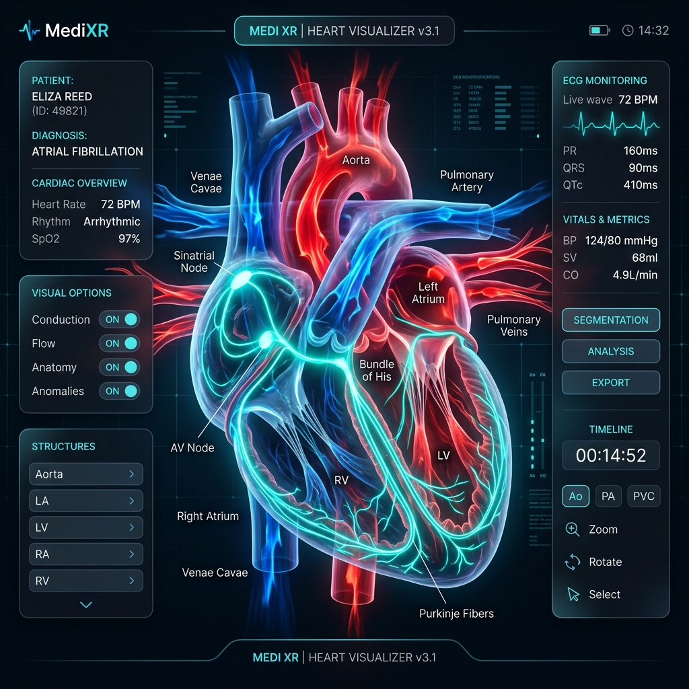

# 🫀 MediXR — Immersive 3D Human Heart Anatomy Visualizer

MediXR is an interactive WebXR medical education application designed to visualize and inspect a medically accurate 3D model of the human heart. It supports **Interactive 3D**, **Augmented Reality (AR)**, **Virtual Reality (VR)**, and **Voice Controls**.



---

## 🌟 Key Features

*   🖥️ **3D Desktop View:** Rotate, zoom, and click on heart structures to view clinical explanations.
*   📱 **Augmented Reality (AR):** Place the 3D heart on any surface in your physical room.
*   🥽 **Virtual Reality (VR):** Step into an immersive VR laboratory with laser pointer controls.
*   🔄 **Anatomy Simulations:** Toggles for heartbeat pulsing, blood flow streams, cross-section slicing, translucent views, and exploded parts.
*   🫀 **Pathology States:** Simulate healthy heart flow, myocardial infarction (heart attack necrotic area), valve disease (leaky backflow), and hypertrophy (ventricular wall thickening).
*   🎙️ **Voice Commands:** Control the app hands-free with voice recognition and text-to-speech audio feedback.

---

## 🚀 Getting Started

### 1. Run the Project
Ensure you have [Node.js](https://nodejs.org/) installed, then run in your terminal:
```bash
# Clone the repository
git clone https://github.com/Naveen2464/heart.git
cd heart

# Run the local server
npm run dev
```

### 2. Open in Browser
The terminal will display your network IP addresses. Open these URLs:
*   💻 **Desktop Simulator:** `http://localhost:8080`
*   📱 **AR/VR headset (Secure HTTPS):** `https://localhost:8443` or `https://<YOUR-IP>:8443`
    *   *Note: Accept the self-signed certificate warning in your mobile browser ("Advanced" -> "Proceed") to allow camera and gyroscopic sensors.*

---

## 🎙️ Spoken Voice Commands

Click the microphone icon on the top right to start listening, then speak:

| Command | Action |
| :--- | :--- |
| **"reset"** / **"restore"** | Resets camera position and controls. |
| **"zoom in"** / **"zoom out"** | Scales the size of the heart model. |
| **"rotate heart"** / **"stop rotation"** | Starts or stops the slow auto-spin. |
| **"show blood flow"** / **"hide blood flow"** | Toggles red/blue blood flow particle streams. |
| **"slice heart"** / **"unslice heart"** | Opens/closes the cross-section view. |
| **"explain heart"** | Speaks the medical function of the highlighted structure. |
| **"left ventricle"** / **"aorta"** / etc. | Highlights and selects specific anatomical structures. |

---

## ⚙️ Sidebar Control Panels

*   **Heartbeat Animation:** Toggle the contraction pulse and slide to adjust speed (BPM).
*   **Blood Flow:** Enable particles representing oxygenated (red) and deoxygenated (blue) blood.
*   **Cross-Section:** Slice the model open and slide the depth slider to view internal chambers.
*   **Anatomy Labels:** Enable floating tags to identify parts.
*   **Transparency & Exploded View:** Turn outer shells see-through or isolate individual structures.

---

## 📂 Codebase Layout

*   `index.html` — Layout and UI overlay HUD.
*   `server.js` — Custom HTTP & secure HTTPS dev server.
*   `styles/main.css` — Modern glassmorphism UI stylesheet.
*   `src/ar/ARManager.js` — AR session camera feed, hit-tests, and taps.
*   `src/vr/VRManager.js` — VR laboratory, controllers, and grab controls.
*   `src/core/` — Core Three.js render loops (`Engine3D.js`), model loading (`ModelLoader.js`), and session listeners (`App.js`).
*   `src/ui/` — Panel click event binders (`UIController.js`) and theme settings (`Accessibility.js`).
*   `src/voice/VoiceEngine.js` — Speech-to-text recognition and text-to-speech feedback.
*   `src/utils/` — Heart data, custom shaders, and geometry fallbacks.
*   `assets/` — 3D `.glb` files and reference diagrams.
